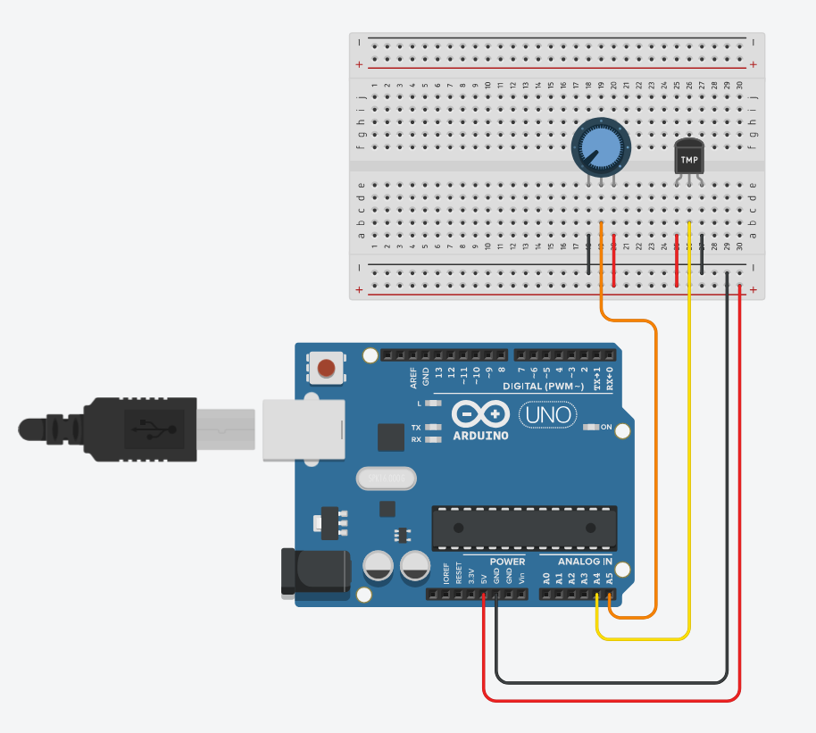
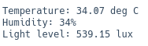

# Arduino Greenhouse Environment Monitor

## Overview
This project is an arduino-based environmental monitoring system designed to measure several conditions of the environment inside a greenhouse.
The circuit measures **temperature**, **light intensity**, and **humidity-related input** and outputs these values in a readable format via the serial monitor.

The aim of the project is to demonstrate how a combination of arduinos/other microcontrollers and sensors can be used to monitor and optimise conditions for plant growth.

The circuit and code were developed using tinkerCad, using the various components available but making substitutions where needed (potentiometer used instead of humidity sensor as there was no humidity sensor available)
The built-in code editor in tinkerCad was also used to program the sketch for the arduino in C++

---

## Features
- Monitor temperature using a TMP36 sensot
- Monitor light level using an LDR
- Monitor humidity (simulated with a potentiometer due to simulator constraints)

- Outputs these values in a readable format with the necessary units via the serial monitor
- Designed to monitor the environment inside a greenhouse.

---

## Hardware (Simulated)
- Arduino Uno
- Potentiometer (Used as a humidity input due to tinkercad constraints)
- TMP36 Temperature sensor
- LDR with a potential divider resistor

> Note: The sensor behaviour is simulated within tinkercad and may not accurately reflect real-word precision.

---

## Software & Calculations
This project includes:
- Analog to digital conversion (ADC) handling
- Voltage conversions from raw sensor readings
- TMP36 voltage to temperature conversion:
  - '(tempVoltage - 0.5) * 100.0'
- Light level estimations using potential divider equation and an approximation of an LDR to lux conversion

Calculations are performed in the sketch file to ensure real-time output.

---

## Use case: Greenhouse monitoring
In a real greenhouse environment, this project could be used to:
- Monitor temperature levels during periods of intense weather
- Monitor light levels to ensure plants inside have sufficient conditions to optimise the rate of photosynthesis
- Monitor air humidity to ensure optimal humidity levels so plants dont undergo too much transpiration and lose water, or not undergo enough transpiration and therefore not pull up necessary nutrients from the roots.
- Provide data to automation systems which can control the environmental conditions

---

## Future improvements
- Threshold alerts for extreme conditions (done with arduino code + LEDs on output pins?)
- LCD Display (Ambitious improvement, very far out of my current abilities)

---

## Screenshots
- The arduino/breadboard based circuit built in tinkercad:
  

- Outputs seen on the serial monitor after giving the circuit some sample data:
  

---

## Technologies used
- Arduino C++
- Tinkercad
- Serial communication
- Basic electronics and sensors

---
